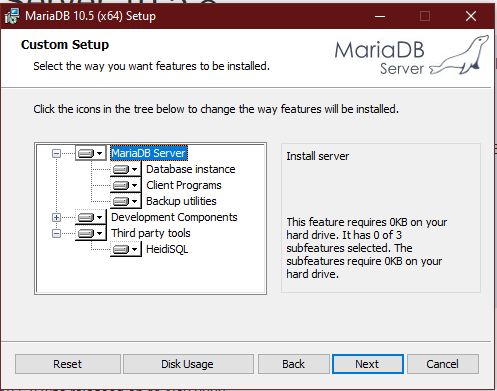
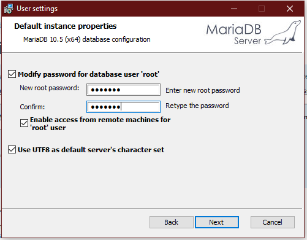
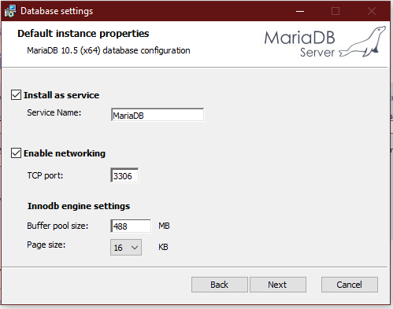
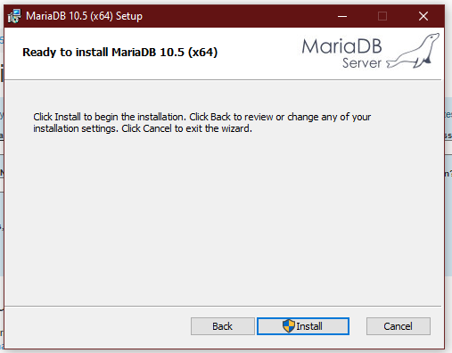

# LOGCOMPARE - GW2 APP

## OVERVIEW

Uses Guild Wars 2 Elite Insight Parser to parse ArcDPS files for comparison. 
This tool creates .json files of percentiles, based on data already inputted by the user (local only).
Requires a database installation.

## SETUP

1. Go to release section, then download the provided installer and install LogCompare.
2. Go to https://mariadb.org/download/ and setup as instructed (below).

### SETUP MARIADB
A) Click next. 

B) Set your password, be sure to remember it to set up LogCompare later. Click next. 

C) Keep as default, click next. 

D) Click install. 

3. Launch LogCompare, enter your database password and you're set!
