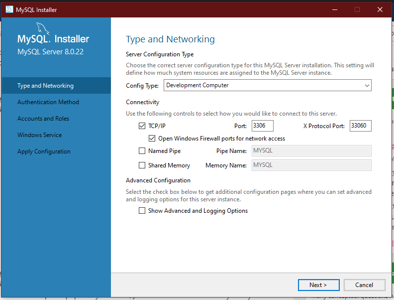
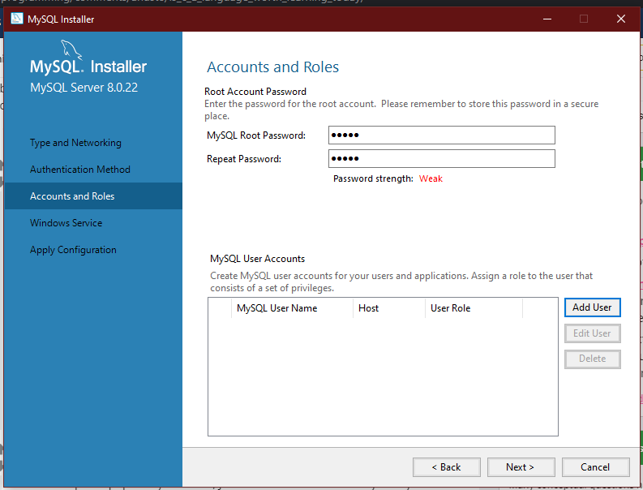
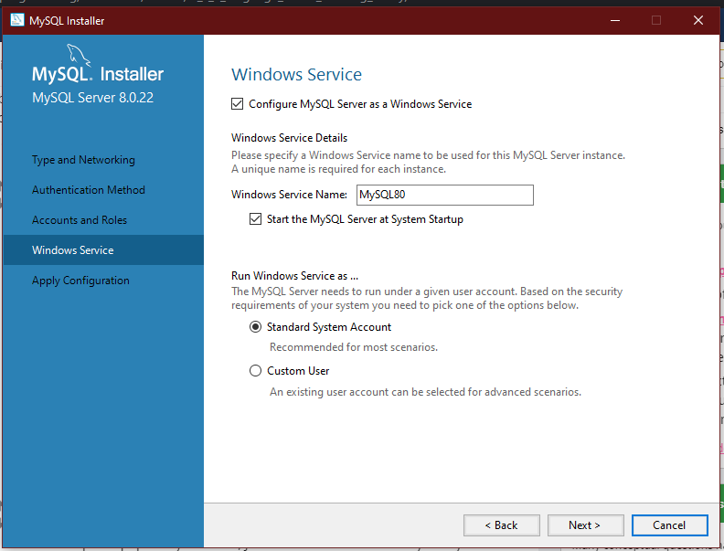
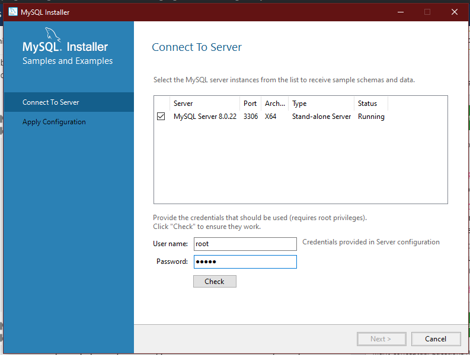
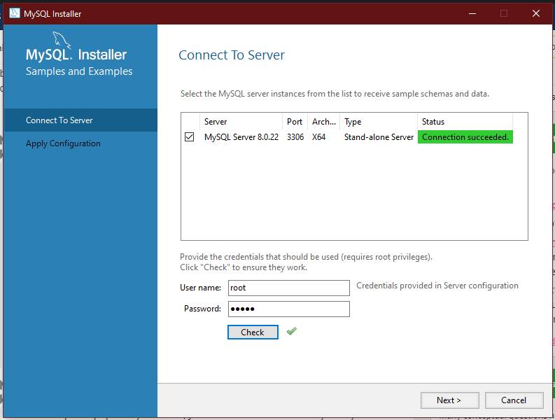
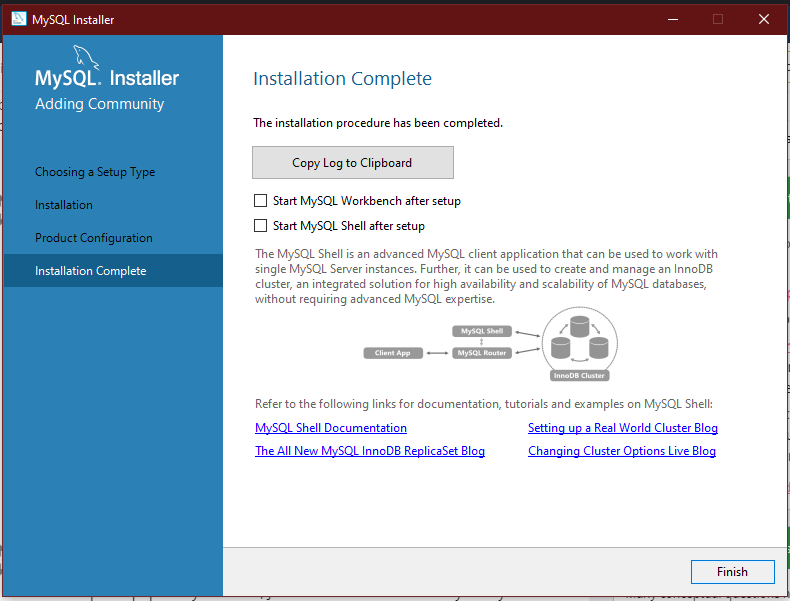

# LOGCOMPARE - GW2 APP

## OVERVIEW

Uses Guild Wars 2 Elite Insight Parser to parse ArcDPS files for comparison. 
This tool creates .json files of percentiles, based on data already inputted by the user (local only).
Requires a database installation.

## SETUP

1. Go to release section, then download the provided installer and install LogCompare.
2. Go to https://dev.mysql.com/downloads/ and setup as instructed (below).
3. Launch LogCompare, enter your database password and you're set!

### SETUP MYSQL
  A) Download the Windows Installer. 
  B) Select default installation and install. 
  
  
  C) Set password. (Remember this as you will need it later to  "login" into LogCompare.)
  
  D) Leave as default.
  
  
  E) When you get to the step of configuring your MySql server, check your password here.
  
  

  F) You're done, close the launcher and open LogCompare!
  